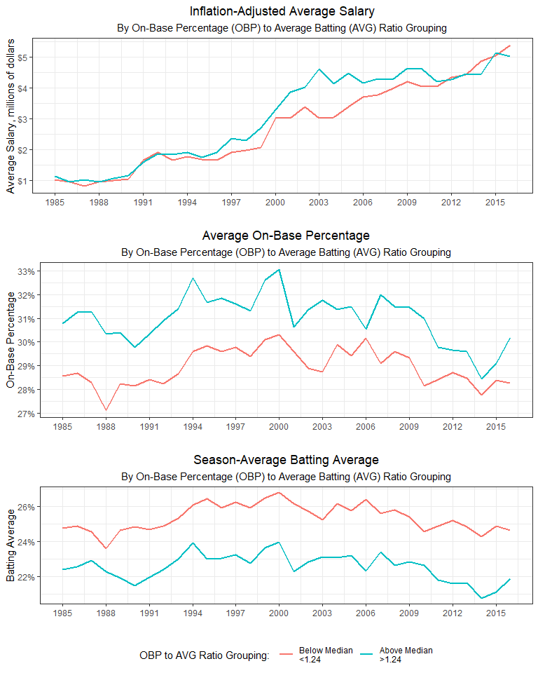
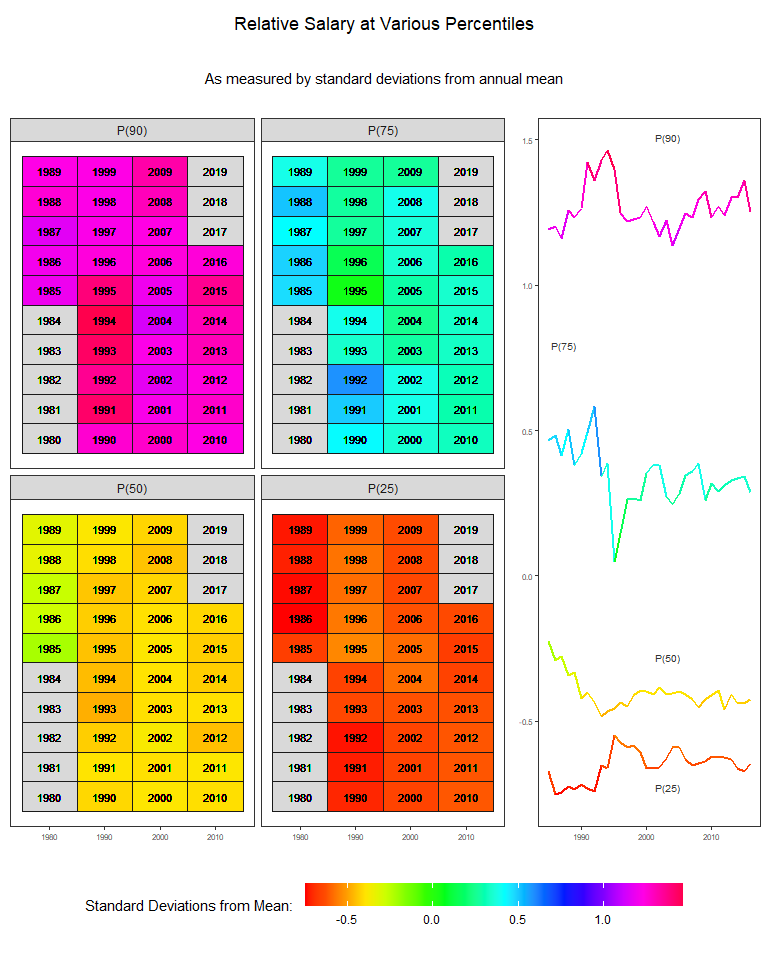
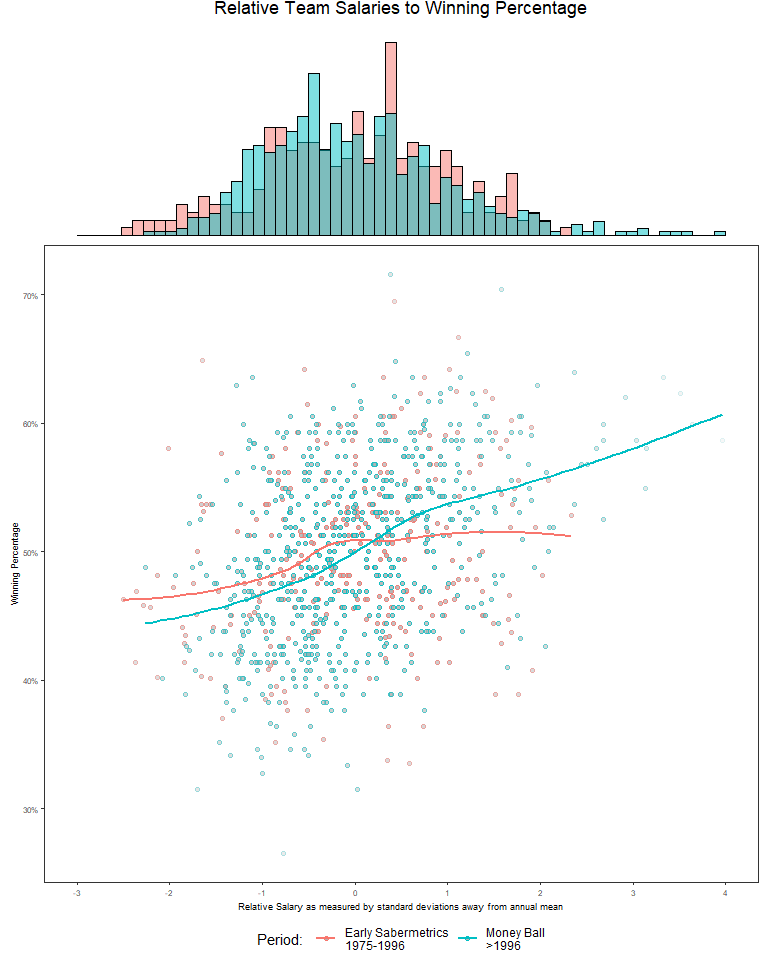
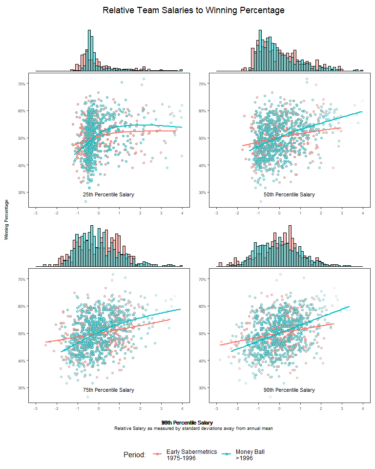
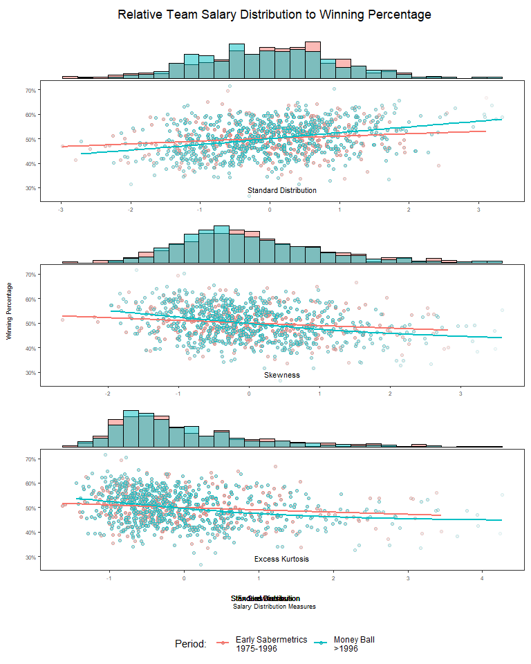

## Impact of Sabermetrics on Player Salaries

### Average Salaries & Metrics

  Because sabermetrics has led to new strategies and a general re-thinking of the game of baseball, this has been manifested in the salaries that players that players earn and the management of how a team distributes these salaries. Assuming that a player’s salary reflects the value that they bring to a team, whether that is through success on the field or through marketability to fill stadiums, we can determine whether sabermetrics has influenced how teams operate and whether the findings of sabermetrics have been implemented into teams’ operations.
  
  One of the more impactful findings of sabermetrics was the overvaluation of the Batting Average (AVG) metric on determining the value of a player. As mentioned in the introduction, On-Base Percentage (OBP) has been determined to be much more significant in determining a player’s valuation; however, these two variables are strongly correlated, having a correlation coefficient of .82. To decide whether teams have implemented sabermetric methodology into their game style, we analyze how players’ salaries changed throughout this period while taking AVG and OBP into consideration. 
  
  Due to the high correlation between these variables, we group players into two categories: those with an OBP to AVG ratio above the median ratio and those below the median, which allows us to mitigate this high correlation. Further, players with a high ratio are relatively undervalued prior to the adoption of sabermetric methodology while players with a low ratio are relatively overvalued. This is because higher ratios had a true measure of value in the numerator (OBP) greater than the imperfect presumed measure of value in the denominator (AVG) meaning that they provided more value than they were being credited for. 
  
  In the chart below, the inflation-adjusted average salary of the two groups were very much the same prior to the rise in sabermetrics in the mid-1990s, but, as sabermetrics began to expand its influence, teams began adjusting their player valuations and the two series begin to diverge. As anticipated, the players with high ratios, or those undervalued, experienced a greater relative increase in salary over those players deemed overvalued. This divergence appears to have peaked in 2003, possibly driven by the historic success that the Oakland A’s experienced in 2002 after a hard pivot into sabermetric methodology, of which the movie Moneyball is based on. However, for reasons not entirely certain, the two series begin a slow convergence after that. One possible reason could be the influx of rookie players during those years which pulled down the OBP metric and lessened the gap between the two groups.

<!-- -->

```
## $value
## TableGrob (3 x 1) "arrange": 3 grobs
##   z     cells    name           grob
## 1 1 (1-1,1-1) arrange gtable[layout]
## 2 2 (2-2,1-1) arrange gtable[layout]
## 3 3 (3-3,1-1) arrange gtable[layout]
## 
## $visible
## [1] FALSE
```

### Distribution of Salaries

  Sabermetrics not only impacted the mean salary but also resulted in changes to the distribution of salaries on a team. After the 2001 season, the Oakland A’s lost their top 3 players and faced drastic budget constraints which limited their efforts in recruiting top players. But in 2002, led by Billy Beane, the Oakland A’s went on to win 20 games in a row, surpassing the record 19-game win streak that had reigned in the American League since 1947, all the while staying within their meager budget. This goes to show that using analytics, lower-funded teams are able to compete with higher-funded teams which would lower the demand (with regard to performance alone) of top baseball stars while increasing the demand of “value” players that could provide significant value in a specific area. In other words, two players may statistically sum up to provide the same value at a lower cost than a team would pay for a single star player, which is the strategy that Beane targeted in his extraordinary season. For this series of analysis, it is assumed that the Moneyball period began in 1996. A Chow Test was used to test when this structural break occurred and it was found to be 1996. As the mid-1990s involved this large transformation to sabermetric methodology and is quite difficult to determine when this period exactly began, this seems to be a reasonable commencement year even if other sources may differ on the exact starting period. 
  
  The chart below visualizes how the salaries at the 90th, 75th, 50th, and 25th percentiles relative to the annual mean salary have changed. These salaries were scaled and centered such that the mean is 0 and standard deviation is 1 for a given year. The standard deviations from the mean drive the numbers below. This transformation is done to negate any impacts from inflation and to control for the going market-rate of professional players.


<!-- -->

```
## $value
## TableGrob (4 x 1) "arrange": 4 grobs
##   z     cells    name                                    grob
## 1 1 (1-1,1-1) arrange    titleGrob[plot.title..titleGrob.532]
## 2 2 (2-2,1-1) arrange titleGrob[plot.subtitle..titleGrob.726]
## 3 3 (3-3,1-1) arrange                         gtable[arrange]
## 4 4 (4-4,1-1) arrange                       gtable[guide-box]
## 
## $visible
## [1] FALSE
```


  Demonstrated above, the 90s were a tumultuous time for player salaries, but the distribution has remained stagnant thereafter. Corresponding with the rise in sabermetrics, there is a drastic decline in the 90th and 75th percentiles; although, the 90th percentile did not drop as significantly as the 75th percentile. This difference could result from the marketability of those players in the P(90) salary range. Baseball stars which would be in these higher percentiles are most likely bringing in value by means of ticket sales that those above-average players in the P(75) percentile are not able to do. 
  
  For whatever reason, the median salary was on a downward trend, relative to the mean, meaning that the distribution was becoming more skewed to the right but this trend abruptly ended during the mid-90s as well. The 25th percentile salaries increased substantially, likely due to a readjustment in the cost-benefit analysis that sabermetrics introduced.
  
  The end-result of these salary adjustments should be a larger marginal benefit for every dollar paid than what was experienced prior to sabermetrics. Assuming that each team’s objective is to be the most successful possible, this marginal benefit translates to a higher winning percentage. For dollars that are more accurately targeted (or a more accurate cost-benefit analysis) to determine salaries, teams should see an increased marginal winning-percentage than before sabermetrics. 
  
  In the chart below, each point represents the total salaries paid by a team for a given year, relative to what other teams are paying that year. The slope of the trend line does steepen during the Moneyball period indicating that sabermetrics is providing more success per dollar than before. The histogram displays the univariate distribution of salaries and does suggest that the insights on percentile movement above were correct: an overall tightening of the distribution, especially among the lower end of the spectrum. 

<!-- -->

```
## $value
## TableGrob (1 x 1) "arrange": 1 grobs
##   z     cells    name                grob
## 1 1 (1-1,1-1) arrange ggExtraPlot[layout]
## 
## $visible
## [1] FALSE
```


  However, this is the net affect of sabermetrics on teams which hides much of the finer details of the decision-making process for teams. By breaking this chart into the 25th, 50th, 75th, and 90th percentiles, the marginal benefit of players in these percentiles and what drives the volatility that was seen in the heatmap becomes apparent. The following chart shows what a team for a given year is paying for its X percentile in salaries among its players, relative to the rest of the field.
  

<!-- -->

  
  We can see why the P(25) salary level experiences a drastic relative salary increase in the early stages of sabermetrics: the marginal benefit, as shown by the trendline, for every dollar increase in salary provides the greatest win percentage increase per dollar than at any other salary level. This large increase does taper off quite rapidly which is the reason the distribution is very tight and occurrences after that taper are much less frequent. The shift to the right in the Moneyball period shows that teams are maximizing their benefit per dollar by increasing the salaries of those players. The rightward skewness indicates that teams are erring on the side of caution by slightly overpaying rather than risk paying too less and losing that large marginal benefit.
  
  This same trend, but to a lesser extent, can be seen for the remaining percentiles as well: an initial steep ascent before tapering off slightly. But these other groups do not experience a tapering off nearly as large as the P(25). The charts do show that teams have taken these marginal benefits into consideration as the left-hand tail of each of these distributions pulls closer towards the center to gain those larger benefits. The P(75) chart does show a tapering off a bit more than the P(50) and P(90) at around 1 standard deviation above average, which teams have also considered as the reduction of occurrences  within that small range. 
  
  Assuming that every team is profit-maximizing, which generally stems from prolonged success, and limited in their resources, they must strategically allocate their available dollars to those inputs (aka players) that will generate the most profit (i.e. wins). This constraint means that for every dollar allocated to a certain player, that is a dollar that will not be going to another player. When sabermetrics showed the large marginal benefit from salary increases at the P(25) level, this stunted (or reduced) salaries at another level, most likely at the P(75) level (as shown by the decrease in the heat map) but for teams that were operating at ~1 standard deviation above the mean, as the marginal benefit was lowest there. This constraint and reallocation of dollars changes the composition of salaries on a team which can also have an impact on performance. 
  
  The following chart shows this composition as measured by the standard deviation, the skewness, and the excess kurtosis of the salaries on a team and their impact to win percentage. The top plot shows a positive relationship of the standard deviation of salaries on a team to winning percentage: the more varied the salaries are on a team, the more successful they are. The Moneyball era does introduce a slightly steeper relationship between these variables which could be a reflection of the prior chart, that there are certain ranges that provide the most benefit and spreading the dollars around to account for these benefits does provide value. 
  
<!-- -->
  
  However, skew has a negative relationship with winning percentage. This could be interpreted as that teams that stretch their budget to pay for a star player at the expense of the rest of the team (becoming rightward skewed) are worse off than they would have been by allocating those dollars around value players. The steepening of this relationship in the Moneyball era exacerbates this problem as sabermetrics points to how those dollars could be put to better use. The leftward shift in the Moneyball era indicates that teams are making the appropriate decisions with regard to paying for top versus value players which was seen in the heatmap as those upper salaries decreased relative to the mean.
  
  Excess kurtosis is a measure of how steep/shallow the point of the distribution is and how fat/narrow the tails are with respect to the normal distribution, zero being equal to the normal distribution. The two periods are very similar but clearly show a downward relationship to winning percentage. Negative values of excess kurtosis mean shallower peak and fatter tails than the normal distribution. Kurtosis is more difficult to visualize, but the minimum kurtosis possible would a distribution with two values on each extreme. The maximum kurtosis would be the opposite with a single heavy weight in the center. At first glance, it seems contradictory that leftward skewness is negatively correlated to win percentage while kurtosis places an emphasis on the ends. But, this indicates where the dollars should come from to pay for a star player. When everyone on the team experiences a decrease to pay for the star, this causes a leftward skew and decreases success. However, when the salaries are reduced among those toward center and simultaneously increased on the lower end, the inclusion of the star player will lead to greater success, per the data.

  Putting these together to help determine the best composition of team salaries, the standard deviation shows that dollars should be spread around to numerous salary levels, the skew tells us that teams are better off adding complementary value players rather than stretch for star players to the detriment of everyone else, and the kurtosis informs where the dollars should likely come from to finance star players. 

